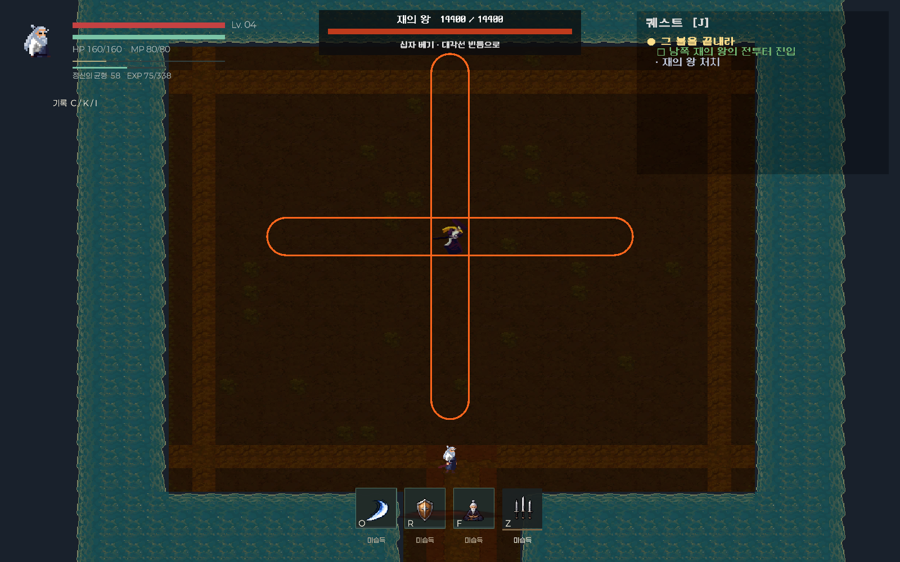

# 첫 보스 · 재의 왕

## 현재 플레이 흐름

야영지 의뢰를 현묵에게 보고하면 Main 남쪽의 문이 열린다. `AshKingArena` 입구에서 E로 정비 제단을 사용하면 체력과 내력을 회복한다. 전투터에 들어가면 뒤쪽 문이 닫히고 재의 왕이 추격한다.

외형은 이전 플레이어였던 보라색 삿갓 검객이다. `MidnightSlash`의 대기·이동·Attack1·Attack2·Death 애니메이션을 별도 보스 컨트롤러로 연결했다. 현재 백발 무사 플레이어는 그대로 사용한다.

| 항목 | 값 / 동작 |
| --- | --- |
| 레벨 / 체력 | 5 / 14,400 (레벨 4 무공 빌드로 약 10분 목표) |
| 이동 속도 | 2.2, 반피 이하에서 2.97 |
| 공격 순서 | 정면 베기 → 직선 찌르기 → 십자 베기 → 회전 베기 → 검우 → 돌진 → 고리 폭발 → 재 폭발 |
| 정면 베기 | 반경 3.2, 130도 부채꼴. 뒤·옆으로 회피. 예고 1초 |
| 직선 찌르기 | 길이 8의 고정 검로. 옆으로 회피. 예고 1.2초 |
| 십자 베기 | 보스를 중심으로 두 검로가 교차. 대각선으로 회피. 예고 1.2초 |
| 회전 베기 | 반경 4.5. 원 밖으로 회피. 예고 1.5초 |
| 검우 | 예고 순간 플레이어 주변 다섯 낙하 원 고정. 원에서 벗어나기. 예고 1.8초 |
| 돌진 | 고정 검로를 따라 최대 10 이동. 옆으로 회피. 벽에서 멈춤, 한 번만 피해. 예고 1.2초 |
| 고리 폭발 | 반경 2.2~6.5 고리. 옥색 중심 또는 고리 바깥이 안전. 예고 1.6초 |
| 재 폭발 | 예고 3.2초. 옥색 원 두 곳 내부는 안전 |
| 기본 피해 | 베기·찌르기·십자·회전·검우 22, 돌진 26, 고리 29, 전체 폭발 35. 광폭화 시 각각 26 / 32 / 34 / 42. 방어·무적 판정 적용 |
| 광폭화 | 체력 50% 이하. 추격이 빨라지고 예고·회복 후 공격 대기가 15% 단축. 잿불 표시 |
| 경험치 | 처치 120 + 처치 의뢰 220 + 현묵 최종 보고 80 |

WASD로 이동하고 일반 공격·충전 대시와 Q/R/F 무공을 사용할 수 있다. 대시가 벽에 막히면 가능한 거리까지만 이동하고 무적 상태를 해제한다.

사망 후 R로 입구 체크포인트에서 재도전한다. 보스는 체력 14,400의 첫 단계로 다시 생성되고, 전투터에 다시 들어가야 시작한다. 처치하면 문이 열리고 마을로 돌아가 현묵에게 최종 보고할 수 있다. 처치·최종 보고는 통합 저장되며, 처치한 보스는 재방문 시 생성되지 않는다.

## 구현과 범위

- `AshKingBoss`: 추격, 여덟 패턴, 고정된 공격 예고 방향·낙하 위치, 안전지대, 실제 돌진·벽 충돌, 광폭화와 실제 처치 판정.
- `AshKingArena`: 생성·재도전·봉쇄·제단·승리 연출. 생성한 보스와 연출의 소유자는 이 씬의 전투 관리 오브젝트다.
- `AshKingHud`: 씬에 배치한 이름·체력·패턴 안내.
- `hub_ash_king` / `hub_isle1_report`: 기존 여섯 의뢰 다음에 자동 시작하는 두 의뢰. 씬별 목록은 동일한 여덟 개다.
- `AshKingSetup.Run`: 기존 마을·사냥터 연결 다음에 실행하는 보스 저작 도구. 원본 씬 전체 재저장을 피하려면 분리된 프로젝트에서 생성한 뒤 필요한 직렬화 필드와 신규 블록만 반영한다.

기획의 기억 선택별 Aggressive/Protective 보스 프로필, 다음 섬, 동굴 튜토리얼은 이번 보스 구현에 포함되지 않는다. 수동 플레이와 사람 기준 난이도 평가는 별도 검사표로 남긴다.

## 검증

- `AshKingCombatVerification.Run`: 여덟 패턴의 실제 피해·회피, 안전지대·광폭화·처치·돌진 충돌·벽 대시·레벨 4 무공 빌드의 9~11분 자동 전투. 별도 저장 슬롯 사용.
- `AshKingStoryVerification.Run`: 실제 Main 포탈, 입구 체크포인트, 사망 재도전, 실제 처치, 최종 NPC 보고, 저장과 재방문. 검사 과정에서 실제 씬 화면도 렌더링한다.
- 결과: `VerificationResults/AshKing`. 기존 전투·저장·UI 회귀도 함께 실행한다.

Unity 6000.3.10f1의 분리된 프로젝트에서 보스 전투 40개 검사가 통과했다. 여덟 패턴을 모두 사용한 레벨 4 무공 빌드의 자동 전투는 **612.7초(10분 13초)**에 처치했다. 초기 체력 600의 짧은 전투를 장기 전투 목표에 맞춰 14,400으로 보정했다. 내력 재생·무공 소모·공격 후 빈틈과 회피를 실제 런타임 판정으로 포함했다.

기준 빌드는 능력치 힘 6·체력 5·방어 3 투자, 월영참 2단계·검의 이치 1단계·금강호신 1단계·운기조식 1단계다. 궁극기는 사용하지 않는다. 0.25초 반응 지연으로 경고를 회피하는 자동 조작 기준이며, 이번 측정에서는 피해를 받지 않았다. 체력으로 목표 시간을 조정하며 강제로 전투 시간을 늘리는 타이머는 없다.

기존 플레이 전투 37개, 저장·복구 48개, UI·성장 54개 회귀 검사가 통과했다. 최종 실제 씬·스토리 30개 검사도 통과했으며, 보스 문·사망 후 초기화·실제 처치·최종 보고·저장·재방문을 포함한다. 총 209개 검사 통과. 여덟 패턴의 실제 씬 렌더링에서 외형·체력바·예고와 안내 문구도 확인했다.

자동 전투의 회피는 결정론적이므로 사람의 플레이 난이도를 대표하지 않는다. 검증 프로젝트는 모델과 일부 에디터 보조 패키지를 분리하며 원본 전체 패키지 빌드 성공을 뜻하지 않는다.
