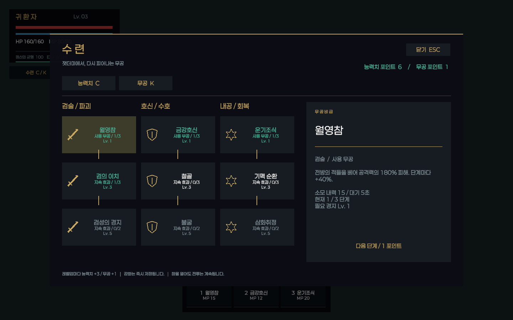
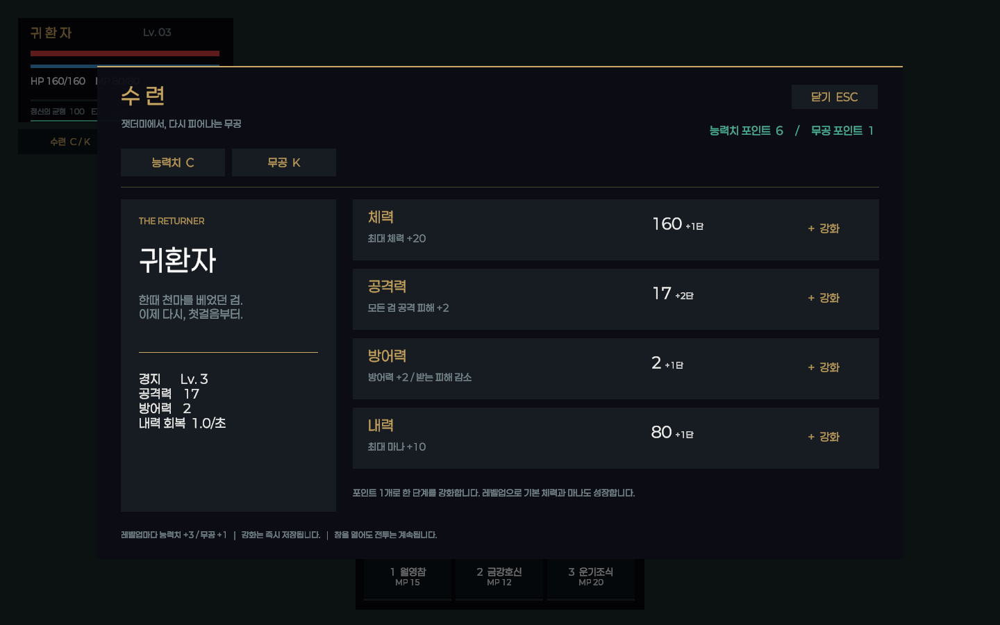

# 무협 RPG 성장 UI

`PlayerStats`가 있는 플레이어에 `RpgSkillController`와 `RpgUI`가 실행 시 자동으로 추가됩니다.
기존 `PlayerHUD`는 새 UI가 있으면 중복 표시하지 않습니다. 원본 맵이나 프리팹을 다시 배치할 필요는 없습니다.





## 조작

- `C`: 능력치 창. 체력, 공격력, 방어력, 내력에 포인트를 투자합니다.
- `K`: 무공 트리. 노드를 선택한 뒤 상세 패널에서 습득하거나 강화합니다.
- `1`: 월영참. 전방 범위 피해.
- `2`: 금강호신. 6초 동안 피해 감소.
- `3`: 운기조식. 체력 회복.
- `Escape`: 성장 창 닫기. 단축바 버튼으로도 무공을 사용할 수 있습니다.

성장 창은 게임 시간을 정지시키지 않습니다. 창을 열면 플레이어 이동과 공격 입력만 차단합니다.
대화, 내면 세계, 사망 중에는 성장 창이 닫힙니다. AI가 몸을 제어 중이면 직접 무공을 사용할 수 없습니다.

## 성장 규칙

신규 캐릭터에게 능력치 5점과 무공 3점을 지급합니다. 레벨업마다 각각 3점과 1점을 얻습니다.
체력 1단계는 최대 HP +20, 공격은 +2, 방어는 +2, 내력은 최대 MP +10입니다.
공격력 투자는 일반 공격과 대시, 월영참에 반영됩니다.
방어력은 `원래 피해 × 100 / (100 + 방어력 × 4)`로 적용하며 금강호신은 추가로 피해를 줄입니다.
양수 피해는 최소 1로 처리합니다.

검술 / 호신 / 내공에 각각 3개 노드가 있습니다. 두 번째 단계는 레벨 3, 마지막은 레벨 5를 요구합니다.
직전 노드를 하나 이상 습득해야 다음 노드를 배울 수 있습니다. 각 강화는 1포인트를 사용합니다.
기본 마나 재생은 초당 1이며 내공 패시브가 이를 높입니다.
스킬 정의와 저장용 인덱스는 `RpgSkillCatalog.cs`에 있습니다. 기존 인덱스를 바꾸면 저장 파일과 충돌하므로 새 스킬은 끝에 추가해야 합니다.

## 저장과 연결

투자, 스킬 습득, 경험치 획득, 종료 시 기존 `player_save.json`에 성장 정보를 저장합니다.
임시 파일을 쓴 뒤 원본을 교체하고 이전 파일은 `.bak`으로 보관합니다.
이전 버전 저장 파일은 체력과 레벨을 보존하며 해당 레벨까지 받을 포인트를 한 번 지급합니다.
저장 파일이 손상되면 백업을 먼저 읽습니다.

화면은 1440×900 기준 CanvasScaler의 Expand 모드를 사용합니다.
한글 폰트는 씬에 로드된 Paperlogy 또는 TMP 기본 폰트를 사용합니다.
문양은 코드로 그리는 벡터 UI라 추가 이미지 의존성이 없습니다.

## 검증

Unity 에디터를 닫은 상태에서 다음 명령을 실행합니다. 검증은 `Temp` 아래의 별도 저장 폴더를 사용합니다.

```powershell
& 'C:/Program Files/Unity/Hub/Editor/6000.3.10f1/Editor/Unity.exe' -batchmode -projectPath C:/AINPC -executeMethod RpgVerification.Run -logFile C:/AINPC/Temp/rpg-verification.log -quit
& 'C:/Program Files/Unity/Hub/Editor/6000.3.10f1/Editor/Unity.exe' -batchmode -projectPath C:/AINPC -executeMethod RpgPlayVerification.Run -logFile C:/AINPC/Temp/rpg-play-verification.log
```

첫 검증은 포인트, 레벨업, 저장 복원과 이전 저장 마이그레이션을 확인하고 실제 Unity UI를 PNG로 렌더링합니다.
두 번째는 실제 Play 모드에서 스킬 피해, 다중 콜라이더 중복 피격 방지, 회복, 방어 효과, 마나 소비와 재사용 제한을 확인한 뒤 자동 종료합니다.
2026-09-19 기준 기능/저장 검증 23개와 Play 모드 전투 검증 13개, 총 36개가 통과했습니다.
이 검증은 본편 맵 전체 진행, 보스 밸런스, LLM 대화까지 검증하지는 않습니다.
