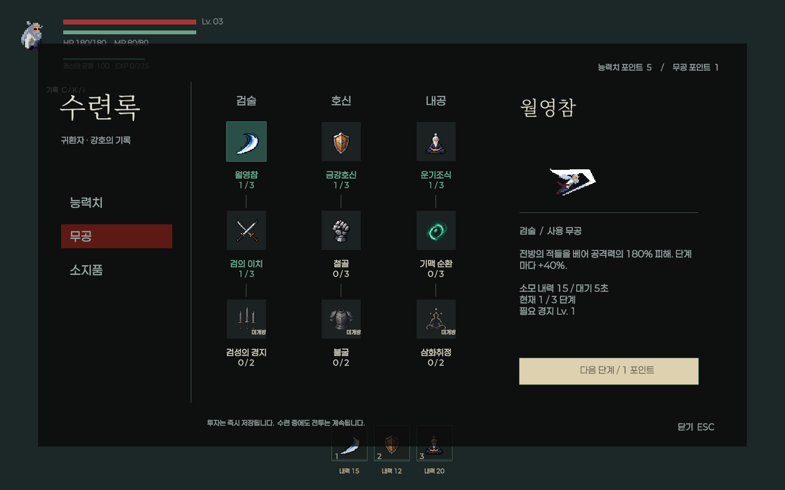
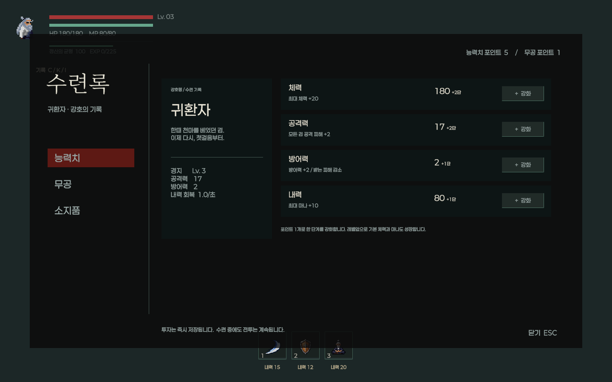
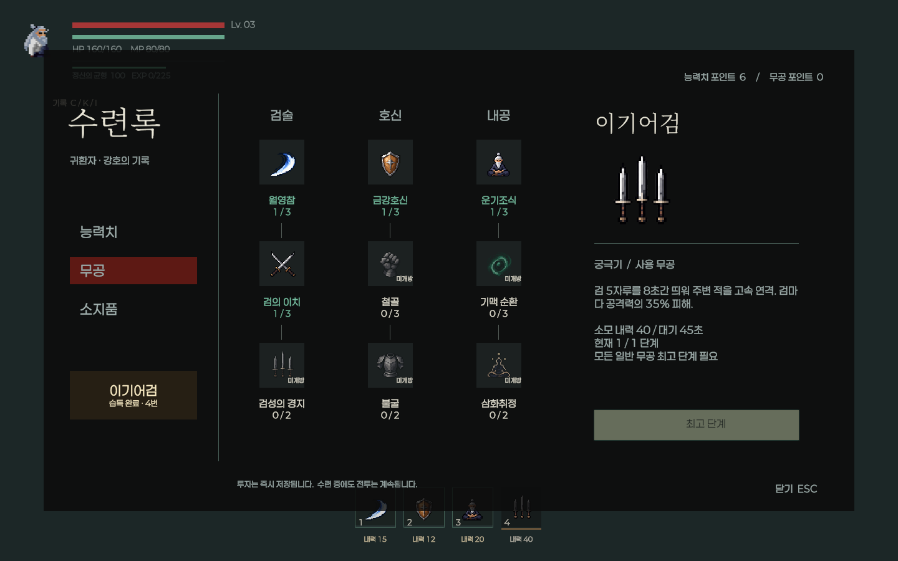

# 무협 RPG 성장 UI

## 승인 시안 기반 UI

`docs/UIConcepts/elder-samurai-no-enemies.png`를 배치 기준으로 사용합니다. 시안에서 적을 제거한 것은 이미지 편집이며 실제 게임의 몬스터 배치와 전투 규칙은 유지합니다.

플레이어는 Mattz Art의 무료 Samurai 에셋을 사용합니다. 원본과 라이선스는 `Assets/Art/Characters/Samurai`에 보관하고, 대기·이동·공격 프레임을 새 Animator에 연결합니다.

전투 HUD에는 실제 캐릭터의 초상과 가는 체력·내력·경험치·Mood 게이지, 하단 스킬 슬롯 3개를 배치합니다. 수련창은 왼쪽 메뉴, 중앙의 검술·호신·내공 9개 아이콘, 오른쪽 설명과 수련 버튼으로 구성합니다. 미개방 무공은 어둡게 표시하고 실제 조건에 따라 습득 버튼을 비활성화합니다.

제목은 Noto Serif KR, 본문은 기존 Paperlogy를 사용하는 별도 TMP 에셋으로 구성합니다. 이전 NeoDunggeunmo 폰트도 보존합니다. 스킬 아이콘은 승인 시안을 참고해 생성한 이미지이며, 플레이어 초상과 공격 예시는 원본 스프라이트에서 추출합니다.

`Tools > AINPC > Apply Illustrated RPG UI`는 현재 씬의 RPG 캔버스를 새 배치로 교체합니다. 해당 캔버스의 개별 배치 편집을 다시 적용해야 하므로 작업 씬을 저장한 뒤 사용하세요. 런타임에서는 저장된 위젯에 값과 입력만 연결합니다.

## 먹색 테마

### 무공 모션 연결

- 월영참: Samurai의 공격 프레임을 재생하고 시전 방향으로 옅은 검기 호를 표시합니다.
- 금강호신: 대기 프레임에 금빛 시전 색상을 입히며 호신 지속 시간 6초 동안 플레이어를 따라가는 빛의 고리를 표시합니다.
- 운기조식: 대기 프레임에 옥색 회복 색상을 입히고 짧은 회복 고리를 표시합니다. 원본 무료 에셋에 방어·좌선 전용 프레임이 없어 전용 자세는 구현하지 않았습니다.

스킬은 Q(월영참), R(금강호신), F(운기조식), Z(이기어검)로 즉시 시전합니다. HUD 슬롯은 표시용이며 클릭으로 시전하지 않습니다. 습득·내력·쿨다운 검사를 통과한 경우에만 모션을 실행합니다. 피해와 회복은 기존 즉시 판정을 유지하고 애니메이션 이벤트로 옮기지 않습니다. 패시브 무공은 별도 시전 모션이 없습니다. 사망·재도전·비활성화 시 생성한 효과와 재질을 정리하고 색상을 복원합니다.

WASD와 가까운 키에 스킬을 배치하고 E는 NPC 상호작용에 유지합니다. Q 일반 능력·Z 궁극기는 [Apex Legends 공식 기본 키](https://help.ea.com/za/help/apex-legends/apex-legends/pc-and-controller-settings/)를 참고했습니다. 모든 게임에 공통인 고정 표준은 없으며 R·F는 이 프로젝트의 빈 키와 기존 상호작용을 고려한 배치입니다. 마우스는 월영참 조준과 기존 일반 공격·충전 대시에 사용합니다. 사망 중 R은 재도전으로만 동작하며, 재도전한 같은 프레임에는 스킬을 시전하지 않습니다.

2026-10-05 키보드 변경 검증: 가상 키보드를 실제 Input System에 연결해 이동 중 Q 시전, R/F/Z 발동, 키 유지 시 반복 방지, 구 숫자 키·슬롯 클릭 미시전, 메뉴·일시정지 차단, R 재도전의 중복 시전 방지를 검사한 **18개**가 통과했습니다. 기존 전투 **37개**, 이기어검 **20개**, UI·성장 **54개**도 별도 저장 슬롯에서 통과했습니다. 결과는 `VerificationResults/SkillKeyboard`에 보존합니다. 숨겨진 검증 창의 입력 포커스는 테스트에서만 조정하고 복원하며, 실제 프로젝트의 입력 설정은 바꾸지 않습니다. 기존 에디터 보조 패키지 문제를 피한 복사 프로젝트에서 검사했으므로 원본 전체 패키지의 빌드 성공과 사람의 수동 플레이 완료를 의미하지 않습니다.

`Tools > AINPC > Connect Samurai Skill Motions`로 기존 Animator에 세 무공 상태를 추가할 수 있습니다. 기존 상태와 GUID는 보존합니다.

2026-10-04 별도 복사 프로젝트의 Play 검사 37개 통과: 세 무공 상태의 실제 진입, 효과 소유 관계, 쿨다운 거절 시 모션 유지, 재도전 후 효과·색상 복구를 확인했습니다. 결과는 `VerificationResults/SkillMotion`에 보존합니다. 최초 실행은 초기 임포트 중 기존 AI 초기화 검사 타이밍 때문에 실패했고, 검사를 실제 플레이 시간으로 기다리도록 수정한 뒤 통과했습니다. 원본 Main 직접 조작 검사는 아직 수행하지 않았습니다.

먹색 패널과 아이보리 본문, 옥색 선택 표시를 사용합니다. 두꺼운 목재 테두리는 UI에서 제거하고 얇은 버튼 가장자리와 구분선으로 정보를 나눕니다. 성장·사망·메뉴·퀘스트·내면·타이틀 화면에 같은 팔레트를 적용합니다.

`Tools > AINPC > Apply Ink UI Theme`는 현재 씬의 `UIRoot`에 테마를 적용합니다. 배치와 위젯 참조는 유지되며, 이미지의 스프라이트·색상과 글자 색상·간격을 바꿉니다. Undo로 되돌릴 수 있습니다. 새 씬을 배치한 뒤 필요한 경우 이 도구를 실행하고 저장하세요. 기존 목재 원본 에셋은 보존합니다.

Main, MapGen_Village, mapstory1, Title 씬의 UI는 `UIRoot` 아래에 저장됩니다.
Play 전에 Hierarchy에서 텍스트, 이미지, RectTransform을 직접 편집할 수 있습니다.
`RpgUI`의 직렬화된 필드는 플레이어와 씬 위젯을 연결하고, 실행 시에는 버튼 연결과 값 갱신만 수행합니다.
기존 `PlayerHUD`는 새 UI가 있으면 중복 표시하지 않습니다.

## 씬에서 편집하기

- HUD는 `UIRoot/RPG · 귀환자의 기록/Vitals`, 단축바는 같은 캔버스의 `Skill bar`입니다.
- 수련창은 `Cultivation overlay`를 활성화하고 `Attributes`, `Skill tree`, `Inventory` 중 편집할 페이지를 활성화합니다.
- 사망 화면은 `Recovery overlay`, 내면 대화창은 `InnerVoiceCanvas/InnerWorldOverlay`를 활성화해 편집합니다.
- 일시정지 메뉴는 `Pause Menu/PauseMenu_Canvas`의 CanvasGroup Alpha를 1로 바꿔 미리 봅니다. 설정·인벤토리·안내는 저장된 자식 패널입니다.
- 타이틀은 `Title_Canvas`의 텍스트와 버튼을 편집합니다. 새 게임은 Main으로 연결됩니다.
- 실행 초기화 시 수련·사망·내면·메뉴 화면은 상태에 맞게 닫히므로, 편집 중 미리 켜둔 화면이 그대로 노출되지 않습니다.
- 새 씬에서는 플레이어를 배치하고 `Tools > AINPC > Bake Scene UI`를 실행한 뒤 씬을 저장합니다. 이미 배치한 UI는 다시 생성하지 않습니다.

Canvas를 삭제하거나 스크립트의 위젯 참조를 끊으면 동작하지 않습니다. 배치 도구는 편집용이며 실행 중 UI 생성용이 아닙니다.
동적 퀘스트·스탯·소지품 문구는 게임 상태에 따라 갱신됩니다. 배치·글꼴·배경·정적인 제목은 씬에서 조정합니다.





## 조작

### 이기어검

수련창 왼쪽 아래 `이기어검` 버튼을 누르면 상세 정보와 습득 버튼을 표시합니다. 기존 9개 무공 모두 최고 단계와 무공 포인트 1을 요구하며 한 단계만 있습니다. 습득 후 `Z`로 사용합니다.

최고 단계가 아닌 무공이 하나라도 있으면 `모든 무공 최고 단계 필요 (완료 개수/9)`를 표시합니다. 2026-10-04 조건 변경 후 UI·성장·저장 검사 54개를 통과했으며 각 무공 하나씩의 단계 부족과 포인트 미소모를 검사했습니다. 결과는 `VerificationResults/UltimateMastery`에 보존합니다.

검 5자루가 한 자루씩 나타난 뒤 7유닛 안의 살아 있는 적을 찾아 8초간 공격합니다. 최대 출격 간격은 0.06초, 비행 속도는 초당 55유닛이며 실제 공격 빈도는 거리와 프레임 속도에 따라 달라집니다. 여러 적이 있으면 번갈아 노리고, 검 한 번의 출격은 콜라이더 수와 관계없이 한 번만 공격합니다. 한 타격 피해는 공격력의 35%를 정수로 반올림합니다. 적이 없으면 캐릭터 뒤에서 대기하며 이동·일반 공격은 가능합니다.

내력 40, 재사용 45초입니다. 메뉴·대화 중에는 새 공격과 피해가 멈추며, 게임 시간이 흐르면 지속 시간은 소모됩니다. 일시정지에는 검 이동과 시간이 함께 멈춥니다. 사망·AI 제어권 전환·비활성화·지속 시간 만료 시 검과 잔상 재질을 정리합니다. 이 첫 버전은 이동 경로의 지형 차단이나 주변 다른 적의 관통 피해를 판정하지 않습니다.

기존 저장의 0–8번 무공 인덱스는 유지하고 이기어검을 9번에 추가합니다. 이전 9칸 저장은 기존 단계가 유지되고 새 무공은 미습득으로 읽힙니다. 쿨다운·소환 중인 검은 저장하지 않습니다.

2026-10-04 복사 프로젝트에서 UI·성장·저장 호환성 44개, 복구 저장 48개, 기존 전투 37개, 이기어검 실제 플레이 16개 검사를 통과했습니다. 빠른 반복 피해, 두 콜라이더에 대한 중복 타격 방지, 적 부재·파괴, 메뉴 중단·재개, 지속 시간 종료, 비활성화·사망 정리를 검사했습니다. 결과는 `VerificationResults/Ultimate`에 보존합니다. 원본 씬의 실제 마우스·키 입력과 지형 위 연출은 수동 검사 항목으로 남아 있습니다.



- `C`: 능력치 창. 체력, 공격력, 방어력, 내력에 포인트를 투자합니다.
- `K`: 무공 트리. 노드를 선택한 뒤 상세 패널에서 습득하거나 강화합니다.
- `Q`: 월영참. 전방 범위 피해.
- `R`: 금강호신. 6초 동안 피해 감소.
- `F`: 운기조식. 체력 회복.
- `Z`: 이기어검. 검 5자루로 고속 연격.
- `Escape`: 성장 창 닫기. 하단 슬롯은 키와 무공 상태를 표시합니다.
- 사망 시 `R` 또는 재도전 버튼: 체크포인트 복귀, HP/MP 회복. 성장과 퀘스트 진행 유지.

성장 창은 게임 시간을 정지시키지 않습니다. 창을 열면 플레이어 이동과 공격 입력만 차단합니다.
대화, 내면 세계, 사망 중에는 성장 창이 닫힙니다. AI가 몸을 제어 중이면 직접 무공을 사용할 수 없습니다.

## 성장 규칙

신규 캐릭터에게 능력치 5점과 무공 3점을 지급합니다. 레벨업마다 각각 3점과 1점을 얻습니다.
체력 1단계는 최대 HP +20, 공격은 +2, 방어는 +2, 내력은 최대 MP +10입니다.
공격력 투자는 일반 공격과 대시, 월영참에 반영됩니다.
방어력은 `원래 피해 × 100 / (100 + 방어력 × 4)`로 적용하며 금강호신은 추가로 피해를 줄입니다.
양수 피해는 최소 1로 처리합니다.

검술 / 호신 / 내공에 각각 3개 노드가 있습니다. 두 번째 단계는 레벨 3, 마지막은 레벨 5를 요구합니다.
직전 노드를 하나 이상 습득해야 다음 노드를 배울 수 있습니다. 각 강화는 1포인트를 사용합니다.
기본 마나 재생은 초당 1이며 내공 패시브가 이를 높입니다.
스킬 정의와 저장용 인덱스는 `RpgSkillCatalog.cs`에 있습니다. 기존 인덱스를 바꾸면 저장 파일과 충돌하므로 새 스킬은 끝에 추가해야 합니다.

## 저장과 연결

투자, 스킬 습득, 경험치 획득, 종료 시 기존 `player_save.json`에 성장 정보를 저장합니다.
임시 파일을 쓴 뒤 원본을 교체하고 이전 파일은 `.bak`으로 보관합니다.
이전 버전 저장 파일은 체력과 레벨을 보존하며 해당 레벨까지 받을 포인트를 한 번 지급합니다.
저장 파일이 손상되면 백업을 먼저 읽습니다.

후속 개선으로 퀘스트·Mood·체크포인트도 같은 파일에 포함합니다. 주 파일이 없어도 백업 복구를 시도하며, 예전 분리 저장은 원본을 남기고 가져옵니다. [통합 저장 상세](RECOVERY_AND_SAVE.md).

화면은 1440×900 기준 CanvasScaler의 Expand 모드를 사용합니다.
RPG 창은 제목에 `UiTitle SDF`, 본문에 `UiBody SDF`를 사용합니다. 다른 UI의 기존 한글 폰트와 폰트 에셋은 보존합니다.
무공 노드와 단축 슬롯은 `Resources/UiArt`의 픽셀 아이콘을 표시합니다. 패널과 버튼은 단색 먹색 배경과 얇은 가장자리를 사용합니다.
Black Hammer의 Fantasy Wooden GUI : Free 2.1 원본 PNG 6개는 `Assets/Resources/RpgWooden`에 보존하지만 현재 UI 표면에는 표시하지 않습니다.
아이보리 본문, 먹색 배경, 옥색 선택 표시를 적용했습니다.
전투 수식과 저장 형식은 유지합니다.
출처와 라이선스는 해당 폴더의 README.md에 기록했습니다.

## 검증

작업 씬을 저장하고 Unity 에디터를 닫은 상태에서 실행하거나, 별도 프로젝트 복사본을 사용합니다. 검증은 빈 씬을 만듭니다. `VerificationResults` 아래의 별도 저장 폴더를 사용하며, 결과는 Unity 종료 후에도 보존됩니다. GUI 실행 파일은 셸에서 먼저 반환할 수 있으므로 결과 파일과 로그의 PASS를 확인해야 합니다.

```powershell
& 'C:/Program Files/Unity/Hub/Editor/6000.3.10f1/Editor/Unity.exe' -batchmode -projectPath C:/AINPC -executeMethod RpgVerification.Run -logFile C:/AINPC/Temp/rpg-verification.log -quit
& 'C:/Program Files/Unity/Hub/Editor/6000.3.10f1/Editor/Unity.exe' -batchmode -projectPath C:/AINPC -executeMethod RpgPlayVerification.Run -logFile C:/AINPC/Temp/rpg-play-verification.log
```

첫 검증은 포인트, 레벨업, 저장 복원과 이전 저장 마이그레이션, 먹색 패널과 버튼 연결을 확인하고 실제 Unity UI를 PNG로 렌더링합니다.

2026-10-04 승인 시안 반영 후 별도 복사 프로젝트에서 UI 검사 38개, 저장 검사 48개, Play 모드 전투 검사 29개를 통과했습니다. 1280×720, 1440×900, 1920×1080 캡처를 확인했습니다. 원본 Main/mapstory1에는 RPG 캔버스와 연결 필드만 반영했으며 Player 프리팹은 SpriteRenderer와 Animator 참조를 교체했습니다. 결과는 `VerificationResults/IllustratedUI`에 보존합니다. 원본의 AI 편집기 패키지 컴파일 문제를 피하려고 복사본에서 해당 패키지를 제외했으므로 원본 전체 패키지 구성의 빌드 성공을 뜻하지는 않습니다. Main 씬의 실제 마우스 입력·맵 전체·LLM 통합 수동 검사는 실행하지 않았습니다.
두 번째는 실제 Play 모드에서 스킬 피해, 다중 콜라이더 중복 피격 방지, 회복, 방어 효과, 마나 소비와 재사용 제한을 확인한 뒤 자동 종료합니다.
2026-09-20 목재 연결 검증에서 기능/저장/실제 버튼 콜백 검사 30개, Play 모드 전투 검사 13개가 통과했습니다. `VerificationResults/RpgVerification/result.txt`와 `VerificationResults/RpgPlayVerification/result.txt`에 결과가 기록됩니다. 캡처에는 1440×900 기본 화면과 1280×720, 1920×1080 무공 화면이 포함됩니다. RenderTexture 캡처는 실제 Game View 창 크기/마우스 입력 검사를 대체하지 않습니다.
이 검증은 본편 맵 전체 진행, 보스 밸런스, LLM 대화까지 검증하지는 않습니다.

검증 로그의 잔여 진단: 최종 Play 실행 시작 때 `UnityEditor.Search.SearchDatabase`의 인덱싱 `ArgumentOutOfRangeException`이 한 차례 기록됐습니다. 이후 13개 검사는 통과했지만 로그 전체가 오류 없는 상태라는 뜻은 아닙니다. 이는 게임 코드가 아닌 에디터 검색 초기화 스택이며 원인/재현성은 추가 확인이 필요합니다. 빈 테스트 씬의 AudioListener 부재 경고와 기존 `InnerVoiceManager.llmTimeout` 미사용 경고도 남아 있습니다. 이번 작업에서는 관련 패키지나 사용자 캐시를 삭제하지 않았습니다.
