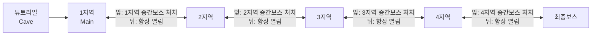
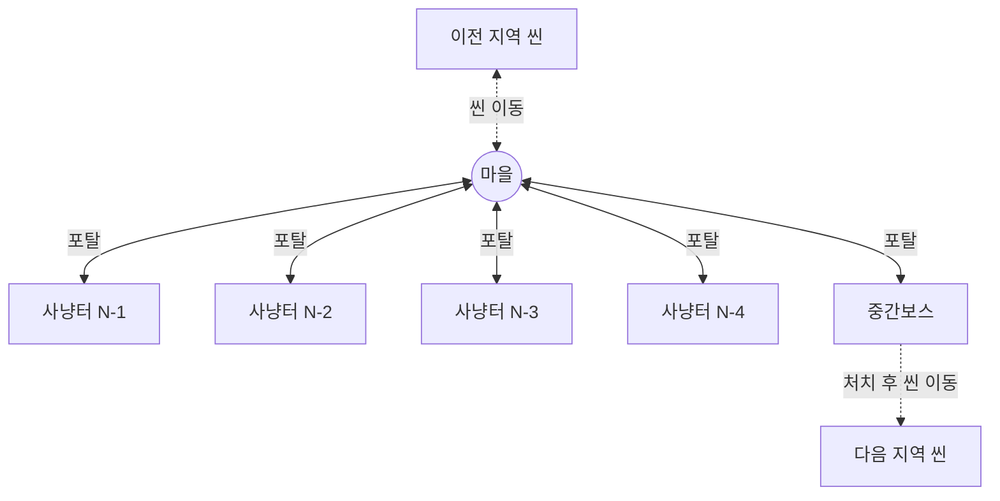

# 스테이지 구조 가이드

작성 기준: 2026-09-29

## 현재 병합 상태

이 문서의 지역 틀은 후속 제작용이다. 현재 첫 섬은 사용자가 선택한 별도 `HuntingGround1`~`4`와 `AshKingArena` 동선을 사용한다. Main에 생성된 `Zone_Village`·`Zone_Hunt1`~`4`·`Zone_Boss`는 씬에 보존하되 비활성화해 두 동선이 동시에 실행되지 않게 했다. `Region2`~`4`와 `FinalBoss` 씬·저작 도구는 보존했으며, 첫 섬의 결말이 자동으로 후속 지역을 열지는 않는다.

동굴의 검 획득·출구와 Main의 `cave_exit` 도착점, 설정 버튼·자동 저장 기능은 현재 동선과 함께 연결한다. 플레이어의 스탯·공격·인벤토리는 공통 프리팹에서 상속하고, 기존 씬의 추가 컴포넌트는 같은 참조 ID로 프리팹 컴포넌트를 가리켜 중복 실행을 막는다. 첫 섬 동작은 [마을 연결](HUB_STORY_CONNECTION.md)과 [재의 왕](ASH_KING_BOSS.md)을 기준으로 확인한다.

### 병합 검증

분리된 Unity 6000.3.10f1 프로젝트에서 전체 씬·실제 동굴 출구·진행 저장 57개, 기존/새 설정 화면 4개, 저장·복구 50개, UI·성장 54개, 플레이 전투 37개, 보스 전투 40개, 보스 스토리 30개로 총 **272개** 검사가 통과했다. 공통 프리팹으로 병합한 뒤 보스 처치는 레벨 4 자동 전투 기준 611.3초(10분 11초)였다. 결과는 `VerificationResults/Merge`에 보관한다.

동굴 검 획득 후 Main으로 이동하고 진행 표시가 통합 저장되는 것을 검사했다. 모델과 일부 에디터 보조 패키지를 분리한 환경이며, 원본 전체 패키지 빌드나 LLM 대화의 검증 완료를 뜻하지 않는다. 사냥터의 이전 설정 화면은 새 자동 저장 위젯이 없어도 정상 초기화되고, 자동 저장 설정은 Main의 새 화면에서 바꿀 수 있다.

게임 전체의 맵 틀을 정하는 문서다. 새 지역 씬을 만들거나 포탈, 사냥터, 보스를 배치할 때
이 문서를 기준으로 삼는다. 표에 "제안"이라고 적힌 값은 아직 확정되지 않은 기본값이고,
확정되면 이 문서부터 고친다.

> 기존 기획서(`GAME_DESIGN_AND_EXECUTION_PLAN.md`, `FIRST_ISLAND_PRODUCTION_PLAN.md`)의
> "섬"은 이 문서의 "지역"과 같은 단위다. 1섬 = 1지역.

---

## 1. 전체 진행



씬은 6개다. 앞으로 가려면 중간보스를 잡아야 하고, 한 번 넘어간 뒤에는 이전 지역으로 언제든 돌아갈 수 있다.

| 순서 | 씬 | 역할 | 다음 씬으로 가는 조건 |
|---|---|---|---|
| 0 | `Title` | 새 게임 / 이어하기 | — |
| 1 | `Cave` | 튜토리얼 동굴. 이동·공격·대화 학습 | 튜토리얼 완료 |
| 2 | `Main` | 1지역 | 1지역 중간보스 처치 |
| 3 | `Region2` | 2지역 | 2지역 중간보스 처치 |
| 4 | `Region3` | 3지역 | 3지역 중간보스 처치 |
| 5 | `Region4` | 4지역 | 4지역 중간보스 처치 |
| 6 | `FinalBoss` | 최종보스전 | 엔딩 |

- 튜토리얼은 기존 `Cave` 씬을 그대로 쓴다.
- 1지역은 기존 `Main` 씬이다. 지금 `Main` 에 있는 마을이 1지역 마을이 되고,
  사냥터와 보스 구역을 같은 씬에 덧붙인다.
- `Region2`~`Region4`, `FinalBoss` 는 새로 만든다 (이름은 제안).
- Build Settings 에 위 순서대로 넣는다.

---

## 2. 지역 씬 구성

모든 지역 씬(`Main`, `Region2`~`Region4`)은 같은 틀을 쓴다.



- **마을** — 지역의 중심. NPC, 퀘스트, 상점, 회복이 여기에 있다. 다른 씬에서 넘어오면 마을로 내리고,
  죽으면 이 마을에서 부활한다. 이전 지역으로 돌아가는 포탈도 마을에 둔다.
- **사냥터 4곳** — 몬스터가 계속 다시 스폰되는 구역. 경험치를 올리는 곳이다. 잠금은 없다.
- **중간보스** — 지역의 마지막 전투. 처음부터 들어갈 수 있고, 이기면 다음 지역으로 가는 길이 열린다.

### 지역 안 이동은 순간이동, 지역 사이 이동은 씬 전환

| 이동 | 방식 | 이유 |
|---|---|---|
| 마을 ↔ 사냥터 / 중간보스 | **같은 씬 안에서 좌표 순간이동** | 사냥터마다 씬을 나누면 씬 수가 5배로 늘고, 오갈 때마다 로딩이 생긴다 |
| 지역 ↔ 지역 | **씬 전환** (`ScenePortal`) | 지역마다 타일맵·NPC·몬스터 세트가 완전히 다르다 |

즉 한 지역 씬 안에 마을, 사냥터 4곳, 보스 구역이 **서로 떨어진 섬처럼** 함께 들어 있고,
걸어서는 이어지지 않으며 포탈로만 오간다.

---

## 3. 씬 안 좌표 배치

구역끼리 충분히 떨어뜨려서, 한 구역에 있을 때 다른 구역이 카메라에 보이거나
몬스터 스폰 범위(`MonsterSpawnArea` 의 카메라 범위 × 2배)에 걸리지 않게 한다.

```
           y
           ▲
   [N-1]   │   [N-2]        (-200, 200)      ( 200, 200)
           │
 ──────── [마을] ────────▶ x  (0, 0)
           │
   [N-3]   │   [N-4]        (-200,-200)      ( 200,-200)
           │
        [중간보스]            (0, -400)
```

| 구역 | 루트 오브젝트 | 중심 좌표 (제안) | 크기 상한 (제안) |
|---|---|---|---|
| 마을 | `Zone_Village` | (0, 0) | 80 × 60 |
| 사냥터 N-1 | `Zone_Hunt1` | (-200, 200) | 80 × 80 |
| 사냥터 N-2 | `Zone_Hunt2` | (200, 200) | 80 × 80 |
| 사냥터 N-3 | `Zone_Hunt3` | (-200, -200) | 80 × 80 |
| 사냥터 N-4 | `Zone_Hunt4` | (200, -200) | 80 × 80 |
| 중간보스 | `Zone_Boss` | (0, -400) | 50 × 50 |

그림 배치는 손으로 그린 구조도와 같은 방향(좌상·우상·좌하·우하, 보스는 아래)으로 맞췄다.
구역 크기가 상한을 넘으면 간격(200)을 늘린다.

`Main` 은 마을이 이미 놓여 있으므로, 마을을 옮기지 말고 **마을 중심을 기준점으로 삼아**
나머지 구역을 위 간격만큼 떨어뜨려 놓는다. 새로 만드는 지역 씬은 위 좌표를 그대로 쓴다.

---

## 4. 씬 계층 구조

지역 씬 하나의 하이어라키는 아래 틀을 따른다.

```
Region2
├─ GameFlow / UIRoot / Main Camera / Player   ← 기존 씬 공통 요소
├─ Zone_Village
│   ├─ Tilemap, 소품, NPC
│   ├─ Spawn_village            (SpawnPoint id = "default")
│   ├─ Spawn_fromNext           (SpawnPoint id = "from_next")
│   ├─ Checkpoint_Village       (PlayerCheckpoint, 부활 위치)
│   ├─ Portal_ToHunt1 … Portal_ToHunt4
│   ├─ Portal_ToBoss
│   └─ Portal_ToPrevRegion      (ScenePortal, 항상 열림)
├─ Zone_Hunt1
│   ├─ Tilemap, 소품
│   ├─ Spawn_hunt1              (SpawnPoint id = "hunt1")
│   ├─ MonsterSpawnArea (+ 자식 MonsterSpawnPoint 여러 개)
│   └─ Portal_ToVillage
├─ Zone_Hunt2 ~ Zone_Hunt4      (Hunt1 과 같은 구성)
└─ Zone_Boss
    ├─ Tilemap, 소품
    ├─ Spawn_boss               (SpawnPoint id = "boss")
    ├─ 중간보스
    ├─ Portal_ToVillage
    └─ Portal_ToNextRegion      (ScenePortal, 보스 처치 전에는 잠김)
```

`Main` 에는 `Portal_ToPrevRegion` 을 두지 않는다 (튜토리얼로는 돌아가지 않는다).

### 입구 이름 규칙

`SpawnPoint.id` 는 씬 안에서만 유일하면 된다. 모든 지역 씬에서 같은 이름을 쓴다.

| id | 위치 | 쓰는 곳 |
|---|---|---|
| `default` | 마을 입구 | 이전 씬에서 앞으로 넘어올 때, 사냥터·보스에서 돌아올 때 |
| `from_next` | 마을 안, 이전 지역 포탈 근처가 아닌 곳 | 다음 지역에서 뒤로 돌아올 때 |
| `hunt1` ~ `hunt4` | 각 사냥터 입구 | 마을 포탈 |
| `boss` | 보스 구역 입구 | 마을 포탈 |

마을 입구를 `default` 로 두면 `ScenePortal` 의 기본값과 `GameFlow.NewGame` 이 그대로 맞는다.
`from_next` 를 따로 두는 것은 "앞으로 가는 포탈"이 보스 구역에 있어서, 뒤로 돌아왔을 때
보스 구역에 내리지 않고 마을에 내리게 하려는 것이다.

### 스프라이트 정렬

구역 안에 세우는 것(NPC, 몬스터, 보스, 포탈 표시물, 소품)은 전부 `YSortRenderer` 를 단다.
포탈 위에 띄우는 표시(화살표, 이름표)는 `YSortRenderer.WorldOverlayOrder` 를 쓴다.

---

## 5. 포탈

### 씬 사이 포탈 — 이미 있음

`ScenePortal` (`Assets/Game/Scripts/Runtime/Control/ScenePortal.cs`) 을 그대로 쓴다.

앞으로 가는 포탈 (보스 구역에 둔다):

| 포탈 | 위치 | targetScene | targetSpawn | requiredFlag |
|---|---|---|---|---|
| 튜토리얼 출구 | `Cave` | `Main` | `default` | `tutorial.cleared` |
| 1지역 → 2지역 | `Main` 보스 구역 | `Region2` | `default` | `region1.boss_cleared` |
| 2지역 → 3지역 | `Region2` 보스 구역 | `Region3` | `default` | `region2.boss_cleared` |
| 3지역 → 4지역 | `Region3` 보스 구역 | `Region4` | `default` | `region3.boss_cleared` |
| 4지역 → 최종보스 | `Region4` 보스 구역 | `FinalBoss` | `default` | `region4.boss_cleared` |

뒤로 가는 포탈 (마을에 둔다, 잠금 없음):

| 포탈 | 위치 | targetScene | targetSpawn |
|---|---|---|---|
| 2지역 → 1지역 | `Region2` 마을 | `Main` | `from_next` |
| 3지역 → 2지역 | `Region3` 마을 | `Region2` | `from_next` |
| 4지역 → 3지역 | `Region4` 마을 | `Region3` | `from_next` |
| 최종보스 → 4지역 | `FinalBoss` 입구 | `Region4` | `from_next` |

뒤로 가는 포탈은 그 지역에 들어온 순간 이미 앞 지역 보스를 잡은 상태이므로 잠글 필요가 없다.

진행 표시(flag)는 `GameFlow.SetFlag` 로 남기고 세이브에 같이 들어간다. 보스가 죽을 때
해당 flag 를 세우는 부분만 새로 붙이면 된다.

### 씬 안 포탈 — 구현됨

아래 설계대로 `GameFlow.TeleportTo`, `CameraFollow.SnapToTarget`, `ZonePortal` 을 만들었다.
`CameraFollow` 는 대상과 `snapDistance`(30) 넘게 떨어지면 알아서 바로 옮기므로, 부활할 때도 날아가지 않는다.

**`GameFlow.TeleportTo(string spawnId)` 추가**

1. 이미 이동 중(`IsLoading`)이면 무시한다.
2. 화면을 암전한다 (`Fade(1f)`, 기존 씬 전환과 같은 연출).
3. `SpawnPoint.Find(spawnId)` 로 도착 지점을 찾아 플레이어를 옮긴다. 기존 `PlacePlayer` 를 재사용한다.
4. 카메라를 도착 지점으로 **즉시** 옮긴다. `CameraFollow` 는 `Lerp` 로 따라가므로, 그대로 두면
   카메라가 맵을 가로질러 날아간다. `CameraFollow` 에 `SnapToTarget()` 같은 메서드를 추가한다.
5. 암전을 푼다 (`Fade(0f)`).

씬을 다시 읽지 않으므로 저장은 하지 않아도 된다. 자동 저장이나 다음 씬 전환 때 현재 좌표로 저장된다.

**`ZonePortal` 컴포넌트 추가** (`ScenePortal` 과 같은 폴더)

- 트리거 콜라이더에 플레이어가 들어오면 `GameFlow.Instance.TeleportTo(targetSpawn)` 를 부른다.
- `requiredFlag` 는 `ScenePortal` 과 모양을 맞추려고 두지만, 지금 설계에서는 모든 구역이 열려 있으므로 비워 둔다.
- 도착 지점을 포탈 위에 두면 도착하자마자 되돌아가는 문제가 생긴다.
  **입구(SpawnPoint)는 반드시 돌아가는 포탈에서 몇 칸 떨어뜨린다.** 씬 사이 포탈도 마찬가지다.

---

## 6. 사냥터와 난이도

사냥터와 보스 구역은 처음부터 모두 열려 있다. 진행 순서는 잠금이 아니라 **몬스터 레벨**로 유도한다.
플레이어가 자기 레벨보다 높은 사냥터에 들어가면 버티기 어렵고, 낮은 사냥터는 경험치가 적어서
자연스럽게 N-1 → N-4 → 중간보스 순으로 넘어가게 만든다.

사냥터의 반복 스폰은 기존 `MonsterSpawnArea` + `MonsterSpawnPoint` 로 된다.

- 빈 스폰 지점만 채우고, `spawnInterval`(기본 10초)마다 다시 확인한다.
- 플레이어 근처(카메라 범위 × `cameraRangeMultiplier`)의 지점만 스폰한다. 그래서 플레이어가
  마을에 있는 동안 다른 사냥터에는 새 몬스터가 생기지 않는다. 구역 간격을 충분히 벌려야 하는 이유다.
- 한 사냥터에 몬스터 종류가 여럿이면 `MonsterSpawnArea` 를 종류별로 하나씩 둔다.
- 몬스터 레벨과 능력치는 `MonsterData` 에 둔다. 같은 몬스터라도 사냥터마다 다른 `MonsterData` 를 써서
  레벨을 바꿀 수 있다.

사냥터별 레벨 (제안, 밸런스 작업 때 확정):

| 구역 | 몬스터 레벨 | 의도 |
|---|---|---|
| N-1 | 지역 시작 레벨 | 지역에 처음 들어오면 가는 곳 |
| N-2 | +1~2 | |
| N-3 | +2~3 | |
| N-4 | +3~4 | 이곳을 돌면 중간보스를 잡을 수 있는 정도 |
| 중간보스 | N-4 보다 조금 위 | 바로 들어가면 지고, 사냥터를 돌고 오면 이길 수 있게 |

다음 지역 N-1 의 레벨은 이전 지역 중간보스 레벨과 이어지게 잡는다.

1지역에서 쓸 수 있는 몬스터 스크립트: `BatMonster`, `GoblinMonster`, `MushroomMonster`,
`SkeletonMonster` (`Assets/Game/Scripts/Runtime/Enemies/`).

---

## 7. 저장·사망·이어하기

| 상황 | 동작 | 코드 변경 |
|---|---|---|
| 이어하기 | 저장된 씬과 **좌표**로 돌아간다. 사냥터에서 저장했으면 사냥터에서 시작한다 | 없음 |
| 씬 전환 | 도착 직후 저장 | 없음 |
| 순간이동 | 저장하지 않음 (자동 저장이 처리) | 없음 |
| 사망 | **죽은 지역의 마을**에서 부활 | 체크포인트 배치 |

부활 위치는 `PlayerStats.CheckpointPosition` 이다. 체크포인트(`PlayerCheckpoint`)를
**각 지역 마을에만 하나** 두고, 사냥터와 보스 구역에는 두지 않는다. 그러면 사냥터나 보스전에서
죽어도 그 지역 마을로 돌아온다.

- 체크포인트 트리거는 마을 입구(`default`)와 `from_next` 도착 지점을 덮도록 놓아서,
  어느 방향으로 들어와도 바로 갱신되게 한다. 사냥터·보스에서 돌아올 때도 `default` 로 내리므로 매번 갱신된다.
- `respawnPoint` 는 `Spawn_village` 로 지정한다.
- 확인할 점: 씬에 들어온 직후 한 번도 체크포인트를 밟지 않고 죽으면 `PlayerStats.Awake` 에서 잡은
  처음 위치로 부활한다. 도착 지점이 체크포인트 안에 있으면 문제없지만, 실제로 트리거가 도는지 플레이로 확인한다.

---

## 8. 작업 순서

1지역(`Main`)을 끝까지 연결한 뒤, 그 구성을 복제해서 2~4지역을 만든다.

> **진행 상황 (2026-10-04)** — 1~3, 5, 6 의 뼈대는 `Tools > AINPC > 스테이지 씬 만들기`
> (`StageSceneBuilder`)로 깔았고 플레이로 확인했다. `Region2`~`Region4`, `FinalBoss` 도 같은 메뉴가
> 회색 바닥 + 벽 + 같은 구역 구성으로 미리 만들어 두었다 (8단계의 "구성 복제"까지는 된 상태).
> 이미 있는 씬은 건너뛰므로 다시 실행해도 손댄 씬을 덮어쓰지 않는다.
>
> 남은 것: 4(사냥터별 `MonsterData` 레벨 차등), 6(저장 후 이어하기 확인), 7(지형), 9(최종보스 연출·엔딩), 10(밸런스).
>
> 문서와 다르게 남아 있는 것:
> - `Main` 은 기존 마을을 `Zone_Village` 로 묶지 않았다. 지형을 건드리지 않으려고 빈 `Zone_Village` 에
>   입구·포탈·체크포인트만 넣었고, 마을 중심은 동굴 출구(`cave_exit`) 자리다.
>   `Cave` 출구는 `default` 대신 `cave_exit` 로 내리지만 두 입구는 같은 자리다.
> - 보스 데이터는 `Assets/Data/Monsters/Bosses/` 의 임시 값이다 (일반 몬스터의 체력·경험치 10배, 공격 2배).

1. **구역 뼈대** — `Main` 에 기존 마을을 `Zone_Village` 로 묶고, 빈 구역 루트 5개(사냥터 4, 보스 1)를
   3장 간격대로 배치한다.
2. **순간이동** — `GameFlow.TeleportTo`, `CameraFollow.SnapToTarget`, `ZonePortal` 구현.
   회색 바닥만 깔린 상태에서 마을 ↔ 각 구역 왕복이 되는지 확인한다.
3. **씬 연결** — `Cave` → `Main` → (임시) `Region2` 로 `ScenePortal` 연결. 보스 처치 flag 로
   앞 포탈이 열리는지, `Region2` 에서 뒤 포탈로 `Main` 마을(`from_next`)에 내리는지 확인한다.
4. **사냥터** — 사냥터 4곳에 `MonsterSpawnArea` 배치, 사냥터별 `MonsterData` 레벨 차등, 반복 스폰과 경험치 획득 확인.
5. **중간보스** — 보스 배치, 처치 시 `region1.boss_cleared` 세우기.
6. **저장·사망** — 마을 체크포인트 배치. 사냥터·보스에서 죽으면 마을에서 부활하는지, 저장 후 이어하기가 되는지 확인.
7. **지형** — 맵 생성기(`Tools > 맵 생성기`)나 직접 타일맵으로 사냥터·보스 구역 지형을 입힌다.
8. **복제** — 새 씬 `Region2`~`Region4` 를 만들고 같은 구역 구성과 포탈을 넣은 뒤, 몬스터·보스·지형만 바꾼다.
9. **최종보스** — `FinalBoss` 씬.
10. **밸런스** — 사냥터·보스 레벨을 플레이로 조정한다.

---

## 9. 정해야 할 것

작업하면서 확정하고, 확정되면 위 내용을 고친다.

- [ ] 사냥터·보스 구역의 몬스터 레벨과 종류 (6장 표).
- [ ] `Region2`~`Region4`, `FinalBoss` 씬 이름.
- [ ] 지역마다 둘 AI NPC 기획 (확정되면 지역 씬에 LLM 계열 컴포넌트를 붙인다. 지금은 `Main` 에만 있다).

### 확정된 것 (2026-10-04)

- 중간보스·최종보스는 한 번 잡으면 다시 나오지 않는다. 보스 구역은 빈 방으로 남는다
  (`StageBoss` 가 자기 처치 flag 가 이미 있으면 시작하자마자 사라진다).
- 튜토리얼 완료 조건은 동굴의 `낡은 검` 줍기다. 주우면 `tutorial.cleared` 가 서고, 그 전에는 동굴 출구가 잠겨 있다.
- 새 게임은 `Cave` 에서 시작한다 (`TitleScreenUI.firstScene`). 튜토리얼을 마친 뒤로는 동굴에 다시 들어가지 않는다.
  돌아가는 포탈이 없고, 동굴에서 저장된 세이브라도 `tutorial.cleared` 가 있으면 이어하기는 `Main` 마을로 간다.
- `Main` 마을 안의 예전 사냥 구역(`Stage1`~`Stage4`)은 지웠다. 사냥은 사냥터 구역에서만 한다.

### 확정된 것 (2026-09-29)

- 튜토리얼 씬은 기존 `Cave` 를 그대로 쓴다.
- 1지역은 기존 `Main` 씬이고, 지금 마을이 1지역 마을이다.
- 중간보스 구역은 처음부터 열려 있다. 레벨 밸런스로 바로 잡기 어렵게 만든다.
- 사냥터 잠금은 없다. 몬스터 레벨로 다음 사냥터로 넘어가도록 유도한다.
- 다음 지역으로 넘어간 뒤 이전 지역으로 돌아가는 포탈을 둔다.
- 죽으면 죽은 지역의 마을에서 부활한다.
